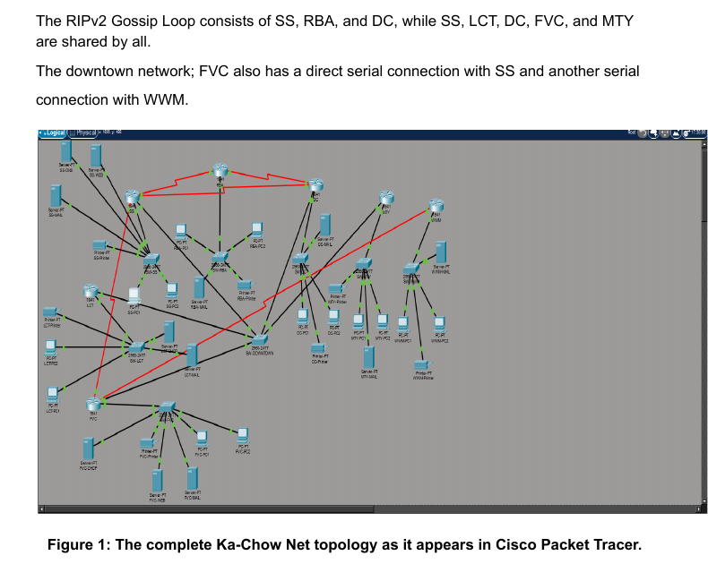

# Ka-Chow Net — The Radiator Springs Network

A Cisco Packet Tracer enterprise-network design for seven Radiator Springs units. The project combines VLSM addressing, mixed dynamic and static routing, redundant paths, centralized and distributed DHCP, DNS, web, email, and printer services.

## Project highlights

- Seven routed LANs: Sheriff's Station (SS), Luigi's Casa Della Tires (LCT), Doc's Clinic (DC), Flo's V8 Cafe (FVC), Radiator Springs Bank (RBA), Mater's Towing Yard (MTY), and Willy's Waste Management (WWM)
- VLSM allocation from the student-ID-derived `11.10.0.0/16` address space
- RIP version 2 across the SS–RBA–DC Gossip Loop, with static-route redistribution at SS
- Full static routing at LCT and MTY, an exit-interface route plus recursive backup at FVC, and a default route at WWM
- IOS DHCP at SS for SS, DC, and RBA; server-based DHCP at LCT and FVC with relays for MTY and WWM
- Central DNS at SS, web servers at SS and FVC, and local mail service at every unit
- Verified end-to-end connectivity, cross-domain email, name resolution, web access, and two routing failover scenarios

## Repository contents

| Path | Purpose |
|---|---|
| [`packet-tracer/Group1808_Ka-Chow_Net.pkt`](packet-tracer/Group1808_Ka-Chow_Net.pkt) | Completed Cisco Packet Tracer topology and configuration |
| [`docs/Ka-Chow-Net-Technical-Report.pdf`](docs/Ka-Chow-Net-Technical-Report.pdf) | Full report: topology, VLSM tree, address table, services, tests, and configurations |
| [`docs/Assignment-Brief.pdf`](docs/Assignment-Brief.pdf) | Original project requirements |
| [`docs/NETWORK-SUMMARY.md`](docs/NETWORK-SUMMARY.md) | Compact technical overview and VLSM plan |
| [`docs/VERIFICATION-CHECKLIST.md`](docs/VERIFICATION-CHECKLIST.md) | Repeatable Packet Tracer validation checklist |
| [`configs/router-configurations.txt`](configs/router-configurations.txt) | Clean text copy of the seven router configurations documented in the report |

## Addressing plan

| Segment | Hosts required | Network | Prefix | Usable range | Broadcast |
|---|---:|---|---:|---|---|
| SS LAN | 260 | `11.10.0.0` | `/23` | `11.10.0.1–11.10.1.254` | `11.10.1.255` |
| DC LAN | 180 | `11.10.2.0` | `/24` | `11.10.2.1–11.10.2.254` | `11.10.2.255` |
| FVC LAN | 150 | `11.10.3.0` | `/24` | `11.10.3.1–11.10.3.254` | `11.10.3.255` |
| LCT LAN | 220 | `11.10.4.0` | `/24` | `11.10.4.1–11.10.4.254` | `11.10.4.255` |
| RBA LAN | 90 | `11.10.5.0` | `/25` | `11.10.5.1–11.10.5.126` | `11.10.5.127` |
| MTY LAN | 90 | `11.10.5.128` | `/25` | `11.10.5.129–11.10.5.254` | `11.10.5.255` |
| WWM LAN | 40 | `11.10.6.0` | `/26` | `11.10.6.1–11.10.6.62` | `11.10.6.63` |
| Downtown transit | 5 routers | `11.10.6.64` | `/29` | `11.10.6.65–11.10.6.70` | `11.10.6.71` |
| SS–RBA | 2 | `11.10.6.72` | `/30` | `11.10.6.73–11.10.6.74` | `11.10.6.75` |
| RBA–DC | 2 | `11.10.6.76` | `/30` | `11.10.6.77–11.10.6.78` | `11.10.6.79` |
| DC–SS | 2 | `11.10.6.80` | `/30` | `11.10.6.81–11.10.6.82` | `11.10.6.83` |
| SS–FVC | 2 | `11.10.6.84` | `/30` | `11.10.6.85–11.10.6.86` | `11.10.6.87` |
| FVC–WWM | 2 | `11.10.6.88` | `/30` | `11.10.6.89–11.10.6.90` | `11.10.6.91` |

## Open and verify

1. Install Cisco Packet Tracer.
2. Open `packet-tracer/Group1808_Ka-Chow_Net.pkt`.
3. Allow interfaces and routing protocols time to converge.
4. Follow `docs/VERIFICATION-CHECKLIST.md` to validate DHCP, routing, DNS, web, email, and failover behavior.

## Design notes

- Router and server addresses are static; client PCs use DHCP.
- Printers use static addresses.
- `11.10.0.2` is the DNS server distributed to clients.
- The assignment text uses two variants for Flo's web hostname (`www.flo.radiatorsprings.nyc` and `www.flosv8.radiatorsprings.nyc`). Validate the DNS record present in the Packet Tracer file when testing.
- The technical report credits Mahir Muntasir Rafsan and uses student ID `22201110` to derive the base network. No separate team work-allocation statement was present in the supplied artifacts, so none has been invented here.

## Contributors

A project by **Mahir Muntasir Rafsan and Ahmed Al Jaber**.

## Attribution

Coursework project and report by **Mahir Muntasir Rafsan**. Cisco Packet Tracer is a Cisco product; this repository is an academic networking project and is not affiliated with Disney, Pixar, or Cisco.
